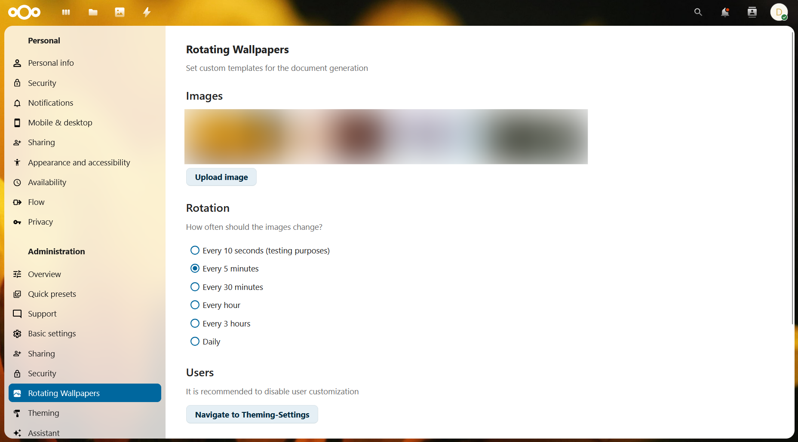

# Rotating Wallpapers

An easy-to-use Nextcloud customization app that adds rotating background wallpapers.



## Features
- Manage wallpapers directly from the Nextcloud admin settings
- Upload and remove background images
- Automatically rotate wallpapers on a configurable schedule
- Dedicated public wallpaper for guests and login pages
- Separate handling for authenticated users and public visitors

## Requirements
- Nextcloud **31+**
- PHP **8.1+** and Composer
- Node.js **20+** and npm

## Usage    
1. Install and enable **Rotating Wallpapers**.
2. Open **Administration settings** in Nextcloud.
3. Select **Rotating Wallpapers**.
4. Upload the images you want to use as backgrounds.
5. Choose a rotation interval.
6. Optionally configure a dedicated public wallpaper for guests.

## Public / Guest Wallpaper
It is possible to configure a seperate single wallpaper for guests. This is useful for the login page or public-facing views.

If a public wallpaper is configured:
- Guests see the public wallpaper as a static background.
- Logged-in users continue to use the rotating wallpaper collection.

If no public wallpaper is configured:
- Guests see the regular wallpaper collection if images are available.

## Supported Upload Formats
The admin upload accepts:

- `.jpg` / `.jpeg`
- `.png`
- `.webp`

## Admin Notes
The app injects the wallpaper background during Nextcloud template rendering. For a consistent look, disabling individual user theming customization is recommended.

You can quickly access the relevant Nextcloud theming settings from the app's admin section.

## Development
Install PHP and frontend dependencies, then build the frontend:

```bash
composer install
npm install
npm run build
```

## Testing
To clear the app data folder, run:

```bash
php occ maintenance:repair --include-expensive
```

or

```bash
sudo -u www-data php occ maintenance:repair --include-expensive
```
